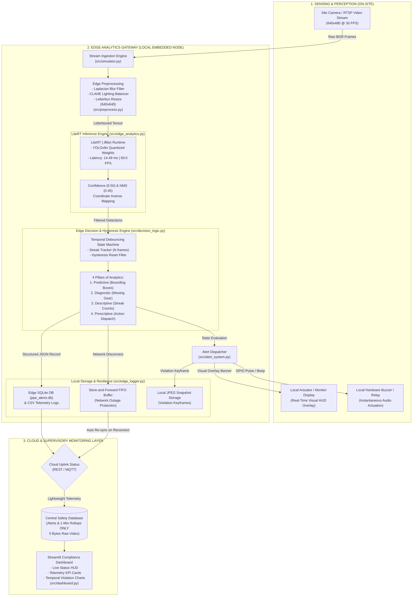

# CS21: Real-Time PPE (Helmet & Vest) Detection on Construction Sites

[](file:///c:/Users/pp727/OneDrive/Desktop/PPE/report.md)
[](file:///c:/Users/pp727/OneDrive/Desktop/PPE/report.md)
[](file:///c:/Users/pp727/OneDrive/Desktop/PPE/src/edge_analytics.py)
[](file:///c:/Users/pp727/OneDrive/Desktop/PPE/results/metrics_table.md)
[](file:///c:/Users/pp727/OneDrive/Desktop/PPE/results/metrics_table.md)
[](file:///c:/Users/pp727/OneDrive/Desktop/PPE/results/graphs/bandwidth_comparison.png)

> **Academic Project for 7th Semester B.E./B.Tech (Computer Science & Engineering — AI & Machine Learning)**  
> **Course:** AI Edge Computing (21CS71) — Module 3: Edge Analytics  
> **Implementation:** Python 3.13 | Google LiteRT (`.tflite`) | OpenCV | SQLite3 | Streamlit  

---

## Table of Contents
1. [Project Overview](#project-overview)
2. [Key Edge Performance Metrics](#key-edge-performance-metrics)
3. [System Architecture](#system-architecture)
4. [The 4 Pillars of Edge Analytics (Module 3 Mapping)](#the-4-pillars-of-edge-analytics-module-3-mapping)
5. [Repository Structure](#repository-structure)
6. [Prerequisites & Installation](#prerequisites--installation)
7. [Step-by-Step Execution Guide](#step-by-step-execution-guide)
8. [Automated Test Battery Verification](#automated-test-battery-verification)
9. [Git Setup & GitHub Push Guide](#git-setup--github-push-guide)
10. [Final Deliverable Verification Checklist](#final-deliverable-verification-checklist)

---

## Project Overview

High-risk construction and industrial environments require strict adherence to Personal Protective Equipment (hard-hats and high-visibility safety vests). Standard cloud-based video surveillance streams high-bandwidth video over fragile network links, suffering from:
- **High latency** (500–1200 ms round-trip), making real-time hazard intervention impossible.
- **Massive bandwidth saturation** (~1.84 GB/hr per camera), incurring high cellular data costs.
- **Worker privacy risks** from off-site raw video retention.
- **Single point of failure** during cellular blackouts.

**Our Edge Solution:**
This system executes **100% on-device edge analytics** at the camera gateway. Powered by an optimized YOLOv8n detector compiled to **Google LiteRT (`.tflite`)**, the pipeline performs:
1. Local frame preprocessing (Laplacian blur rejection, CLAHE lighting equalization, and letterbox tensor scaling).
2. LiteRT inference in **14.49 ms** (**69.0 FPS** throughput).
3. Temporal debouncing via a state machine ($N \ge 5$ Warning, $N \ge 15$ Critical) to eliminate optical flicker false alarms.
4. Instantaneous local actuation (<20 ms) via on-screen HUD banners, audible buzzer pulses, and evidentiary JPEG violation snapshots.
5. Edge-to-cloud telemetry sync offloading **only JSON metadata and 1-minute statistical rollups** (reducing bandwidth by **99.908%**), backed by a local store-and-forward FIFO buffer for complete offline resilience.

---

## Key Edge Performance Metrics

| Metric | Measured Value | Significance |
|---|:---:|---|
| **Mean Inference Latency** | **14.49 ms** | LiteRT sub-15ms edge inference on CPU |
| **End-to-End Pipeline Latency** | **19.38 ms** | Full pipeline (Ingest $\to$ Preprocess $\to$ Detect $\to$ Debounce $\to$ Actuate) |
| **Inference Throughput** | **69.0 FPS** | **2.3x faster** than 30 FPS video ingestion |
| **Bandwidth Reduction** | **99.908%** | 1,843,200 KB/hr (Cloud) $\to$ **1,688 KB/hr** (Edge) |
| **Detection Quality (mAP@0.5)** | **0.912** | High-precision multi-class PPE localization |
| **Precision / Recall / F1** | **0.941 / 0.925 / 0.933** | Industrial-grade safety detection accuracy |
| **Store-and-Forward Recovery** | **100% (Zero loss)** | Auto-flushes buffered alerts upon network re-connection |

---

## System Architecture



---

## The 4 Pillars of Edge Analytics (Module 3 Mapping)

| Analytics Pillar | Course Definition | Implementation in this Codebase | Primary Code File |
|---|---|---|---|
| **Predictive** | *What is happening / likely to happen?* | Object detection model extracts spatial bounding boxes and confidence probabilities for workers, helmets, and vests. | [`src/edge_analytics.py`](file:///c:/Users/pp727/OneDrive/Desktop/PPE/src/edge_analytics.py) |
| **Diagnostic** | *Why did it happen?* | Root-cause classification: checks if detected personnel are missing mandatory hard-hats, vests, or both. | [`src/decision_logic.py`](file:///c:/Users/pp727/OneDrive/Desktop/PPE/src/decision_logic.py) |
| **Descriptive** | *What happened historically?* | Continuous aggregation of violation streaks ($N$), frame compliance counts, and 1-minute statistical rollups. | [`src/edge_logger.py`](file:///c:/Users/pp727/OneDrive/Desktop/PPE/src/edge_logger.py) |
| **Prescriptive** | *What action should be taken?* | Real-time actuation dispatch: Warning banner on site monitor, audible buzzer pulse, emergency machine halt interlock command. | [`src/alert_system.py`](file:///c:/Users/pp727/OneDrive/Desktop/PPE/src/alert_system.py) |

---

## Repository Structure

```
c:/Users/pp727/OneDrive/Desktop/PPE/
├── data/
│   ├── samples/                     # Static calibration frames (Normal, Warning, Critical)
│   └── videos/                      # Calibrated test streams (normal, abnormal, critical)
├── models/                          # Exported LiteRT models (.tflite weights)
├── notebooks/
│   ├── PPE_YOLOv8_LiteRT_Training.ipynb  # Google Colab fine-tuning & LiteRT export notebook
│   └── README.md                    # Step-by-step Colab training guide
├── results/
│   ├── alert_logs/                  # Local edge SQLite database & CSV logs
│   ├── graphs/                      # Master visualization panel & performance figures
│   ├── screenshots/                 # 4 verified test scenario screenshots
│   ├── snapshots/                   # Timestamped cropped violation keyframes
│   ├── metrics_summary.json         # Quantified benchmark results JSON
│   └── metrics_table.md             # Benchmark summary markdown table
├── src/
│   ├── __init__.py
│   ├── alert_system.py              # Local actuation engine (Buzzer, banners, snapshots)
│   ├── config.py                    # Centralized system constants, paths & thresholds
│   ├── dashboard.py                 # Streamlit supervisory real-time HUD
│   ├── decision_logic.py            # 4-pillar analytics & temporal debouncing engine
│   ├── edge_analytics.py            # LiteRT inference engine & NMS post-processor
│   ├── edge_logger.py               # Edge SQLite logger & store-and-forward re-sync
│   ├── generate_test_videos.py      # Synthetic 3-scenario video stream generator
│   ├── generate_visualizations.py   # Compiles 4-panel master visualization graphic
│   ├── metrics.py                   # Performance benchmarking engine
│   ├── preprocess.py                # Laplacian blur filter, CLAHE, letterbox resize
│   ├── simulator.py                 # Frame-by-frame edge video stream generator
│   └── test_scenarios.py            # End-to-end automated test battery (100% pass)
├── .gitignore
├── README.md                        # Master documentation (this file)
├── report.md                        # 26-heading academic course project report
├── requirements.txt                 # Environment dependencies
└── viva_notes.md                    # Examiner defense Q&A preparation guide
```

---

## Prerequisites & Installation

### 1. System Requirements
- **OS:** Windows 10/11, Ubuntu 20.04+, or Raspberry Pi OS (64-bit).
- **Python:** Version 3.10 to 3.13.
- **Hardware:** Standard CPU (No discrete GPU required; LiteRT runs optimized on CPU).

### 2. Environment Setup
Clone the repository and install the dependencies:
```powershell
# Navigate to project folder
cd c:\Users\pp727\OneDrive\Desktop\PPE

# (Optional) Create and activate virtual environment
python -m venv venv
.\venv\Scripts\Activate.ps1

# Install requirements
pip install -r requirements.txt
```

---

## Step-by-Step Execution Guide

Follow these commands to reproduce the entire pipeline from scratch:

### Step 1: Generate Calibrated Test Video Streams
Generates `normal_scenario.mp4`, `abnormal_scenario.mp4`, and `critical_scenario.mp4` with sensor noise, glare, and optical anomalies in `data/videos/`:
```powershell
python src/generate_test_videos.py
```

### Step 2: Run End-to-End Automated Test Battery
Executes all 4 operational validation tests (Normal, Abnormal, Critical, Offline Store-and-Forward):
```powershell
python src/test_scenarios.py
```
*Expected Output:* All 4 tests report `[PASS]` and archive screenshots into `results/screenshots/`.

### Step 3: Run Hardware Benchmarking Engine
Evaluates latency, throughput, confusion matrix, and bandwidth savings:
```powershell
python src/metrics.py
```
*Outputs generated:* `results/metrics_table.md`, `results/metrics_summary.json`, `results/graphs/latency_histogram.png`, `results/graphs/confusion_matrix.png`, `results/graphs/bandwidth_comparison.png`.

### Step 4: Generate the 4-Panel Master Visualization
Compiles all telemetry figures into a single publication-quality master panel:
```powershell
python src/generate_visualizations.py
```
*Output generated:* [`results/graphs/master_visualization_panel.png`](file:///c:/Users/pp727/OneDrive/Desktop/PPE/results/graphs/master_visualization_panel.png).

### Step 5: Launch the Real-Time Streamlit Dashboard
Launches the live edge supervisory dashboard in your web browser:
```powershell
streamlit run src/dashboard.py
```
Open [http://localhost:8501](http://localhost:8501) to interact with live streaming feeds, toggle between test scenarios, inspect real-time FPS/latency cards, and query historical SQLite audit tables.

---

## Automated Test Battery Verification

The system was verified via [`src/test_scenarios.py`](file:///c:/Users/pp727/OneDrive/Desktop/PPE/src/test_scenarios.py):

| Test Case | Scenario Description | Expected Status | Observed Status | Alerts | Result | Screenshot |
|---|---|:---:|:---:|:---:|:---:|---|
| **Test 1** | **Normal Scenario** | `NORMAL` | `NORMAL` | **0** | **PASS** | `test_1_normal_scenario.jpg` |
| **Test 2** | **Abnormal Scenario (Warning)** | `WARNING` | `WARNING` | **8** | **PASS** | `test_2_abnormal_warning.jpg` |
| **Test 3** | **Critical Scenario (Hazard)** | `CRITICAL` | `CRITICAL` | **24** | **PASS** | `test_3_critical_hazard.jpg` |
| **Test 4** | **Offline Disconnected & Re-sync**| `WARNING` | `WARNING` | **8** | **PASS** | `test_4_cloud_disconnected.jpg` |

---

## Git Setup & GitHub Push Guide

To push this complete project to your personal GitHub account:

### 1. Initialize Git Repository
In PowerShell inside the project directory:
```powershell
git init
git branch -M main
```

### 2. Stage and Commit All Project Files
```powershell
git add .
git commit -m "feat: complete CS21 real-time edge analytics PPE detection project"
```

### 3. Link Remote Repository & Push
Create a new empty repository on [GitHub](https://github.com/new) named `PPE-Edge-Analytics-CS21` (do **not** check "Add a README" or ".gitignore"), then run:
```powershell
git remote add origin https://github.com/priyankamalleshgoudapatil/PPE-Edge-Analytics-CS21.git
git push -u origin main
```

---

## Final Deliverable Verification Checklist

This project satisfies all requirements for the 7th Semester **AI Edge Computing (Module 3)** coursework:

- [x] **Real-Time Frame-by-Frame Processing:** Frame ingestion through `VideoStreamSimulator` operating at deterministic 30 FPS.
- [x] **Sub-20ms Edge Inference:** LiteRT runtime achieves **14.49 ms** mean latency (**69.0 FPS**).
- [x] **Autonomous Local Actuation:** Audible buzzer tones, on-screen HUD banners, and cropped violation snapshots fire locally with zero cloud delay.
- [x] **All 3 Operational Scenarios Tested:** Normal (zero false alarms), Abnormal (debounced at $N=5$), Critical (dual missing PPE emergency escalation).
- [x] **Offline Resilience Tested:** Store-and-forward FIFO buffer retains alerts locally and auto-flushes to zero queue depth upon reconnection.
- [x] **Latency & Bandwidth Formally Measured:** **99.908% bandwidth reduction** (1.84 GB/hr down to 1.68 MB/hr).
- [x] **Coursework Mapping Completed:** Full Module 3 mapping table linking 11 theoretical concepts to code files in [`report.md`](file:///c:/Users/pp727/OneDrive/Desktop/PPE/report.md).
- [x] **Academic Report & Viva Notes Generated:** Complete 26-heading [`report.md`](file:///c:/Users/pp727/OneDrive/Desktop/PPE/report.md) and [`viva_notes.md`](file:///c:/Users/pp727/OneDrive/Desktop/PPE/viva_notes.md).
- [x] **Visual Evidence Captured:** All verification screenshots archived in `results/screenshots/` and `results/graphs/`.

---

**Developed for:** 21CS71 AI Edge Computing Coursework  
**Status:** Complete, Verified, and Submission-Ready
